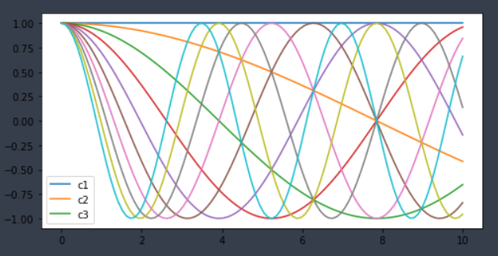

# Matplotlib

### Matplotlib 특징

- 파이썬의 대표적인 과학 계산용 그래프 라이브러리
- 선 그래프, 히스토그램, 산점도 등의 고품질 그래프 제공
- 저수준 api를 사용한 다양한 시각화 기능 제공
- 다양한 운영체제와 그래픽 백엔드에서 동작

```python
import matplotlib as mpl
import matplotlib.pyplot as plt # 대부분의 시각화를 담당해주는 pyplot
import pandas as pd
import numpy as np
```


### 라인 플롯(Line Plot)

- 플롯(plot)은 그림(figure)와 축(axes)으로 구성
- `plt.Fiqure`: 축과 그래픽, 텍스트, 레이블을 표시하는 모든 객체를 포함하는 컨테이너
- `plt.Axes`: 눈금과 레이블이 있는 테두리 박스로 시각화를 형성하는 플롯 요소 포함

```python
fig = plt.figure() # figure 약어 fig
ax = plt.axes() # axes 약어 ax
```

> 


```python
fig = plt.figure()
plt.plot([0,0.2,0.4,0.6,0.8,1] * 5) # *5 => 5번 반복
# *5)뒤에 세미콜론(;)을 붙이면 [<matplotlib.lines.Line2D at 0x1cf6763c5b0>] 이 설명 문구가 안 나옴
```

> 


곡선 만들기

```python
x = np.arange(0,10,0.01)

fig = plt.figure()
plt.plot(x, np.sin(x));
```

> 


누적합에 대한 그래프

```python
plt.plot(np.random.randn(50).cumsum()); # cumsum : 누적합
```

> 


### 라인 스타일(Line Style)

**문자**		**스타일**

**"-"**	 		**"solid"**

**"--"**			**"dashed"**

**"-."**			**"dashdot"**

**":"**			**"dotted"**


```python
plt.plot(np.random.randn(50).cumsum(), linestyle="solid") # == (linestyle ="-")
plt.plot(np.random.randn(50).cumsum(), linestyle="dashed") # == (linestyle ="--")
plt.plot(np.random.randn(50).cumsum(), linestyle="dashdot") # == (linestyle ="-.")
plt.plot(np.random.randn(50).cumsum(), linestyle="dotted") # == (linestyle =":")
```

> 


### 색상 스타일(Color Style)

- 색상 문자

  - 문자		색상

    "b"			blue

    "g"			green

    "r"			red

    "c"			cyan

    "m"			magenta

    "y"			yellow

    "k"			black

    "w"			white


```python
plt.plot(np.random.randn(50).cumsum(), color = "g")
plt.plot(np.random.randn(50).cumsum(), color = "#1243FF")
plt.plot(np.random.randn(50).cumsum(), color = (0.2,0.4,0.6))
plt.plot(np.random.randn(50).cumsum(), color = "pink")
```

> 


라인 스타일과 색을 합쳐서 단축키로 표현할 수 있다.

```python
plt.plot(np.random.randn(50).cumsum(), "b-")
plt.plot(np.random.randn(50).cumsum(), "g--")
plt.plot(np.random.randn(50).cumsum(), "c-.")
plt.plot(np.random.randn(50).cumsum(), "m:")
```

> 


### 플롯 축(Plot Axis)

```python
plt.plot(np.random.randn(50));
plt.xlim(-1, 50)
plt.ylim(-5, 5); # lim : 범위값을 조정해서 넓게 보여줌. => 원래는 범위값 3에 딱맞게 보여줬었지만 -5~5로 지정해줘서
# 넓어졌음
```

> 


lim을 plt.axis에 list로 넣어줄 수 있음

```python
plt.plot(np.random.randn(50))
plt.axis([-1,50,-5,5]); # 같은 결과
```

> 

plt.axis 속성으로 "tight", "equal"을 넣어줘서 범위를 다르게 보여줄 수 있음

"tight" 속성은 범위값에 최대한 맞게해서 그래프를 크게 보여주고

"equal" 속성은 범위값을 보다 큰 범위로 보여줘서 그래프를 작게 보여줌

이해하기 쉽게 확대, 축소했다고 생각하면 됨


```python
plt.plot(np.random.randn(50))
plt.axis("tight"); # 좁은 범위로 보여줌
```

> 

```python
plt.plot(np.random.randn(50))
plt.axis("equal"); # 넓은 범위로 보여줌
```

> 


### 플롯 레이블(Plot Label)

- xlabel( )

  x축의 이름을 지정해주는 함수

- ylabel( )

  y축의 이름을 지정해주는 함수

- title( )

  그래프(plot)의 이름을 지정해주는 함수

```python
plt.plot(np.random.randn(50))
plt.title("title")
plt.xlabel("x")
plt.ylabel("random.randn")
```

> 


plot에 label을 달아서 이름을 지정해주고 

legend 함수를 사용하여 라벨을 표기해줄 수 있음

```python
plt.plot(np.random.randn(50),label="A")
plt.plot(np.random.randn(50),label="B")
plt.plot(np.random.randn(50),label="C")
plt.title("title")
plt.xlabel("x")
plt.ylabel("random.randn")
plt.legend();
```

> 


밑에 박스가 레전드이다!


### 폰트 관리자(Font Manger)

```python
set([f.name for f in mpl.font_manager.fontManager.ttflist]) # 리스트 컴프레션을 사용하여 폰트매니저 내에 있는 폰트리스트를 불러옴 
```

> ```
> {'ABSTER',
>  'Adobe Arabic',
>  'Adobe Caslon Pro',
>  'Adobe Devanagari',
>  'Adobe Fan Heiti Std',
>  'Adobe Fangsong Std',
>  'Adobe Gothic Std',
>  'Adobe Hebrew',
>  'Adobe Heiti Std',
>  'Adobe Kaiti Std',
>  'Adobe Ming Std',
>  'Adobe Myungjo Std',
>  'Adobe Song Std',
>  'Amatic SC',
>  'AmeriGarmnd BT',
>  'Arial',
>  'BM EULJIRO TTF',
>  'BM JUA_TTF',
>  'Bahnschrift',
>  'Baskerville BT',
>  'Batang',
>  'BernhardFashion BT',
>  'Big John',
>  'Birch Std',
>  'Black Han Sans',
>  'Blackoak Std',
>  'Blacksword',
>  'Blippo Blk BT',
>  'Bodoni Bd BT',
>  'Bodoni Bk BT',
>  'BroadwayEngraved BT',
>  'Brush Script Std',
>  'BrushScript BT',
>  'Calibri',
>  'Cambria',
>  'Candara',
>  'Celtic Garamond the 2nd',
>  'CentSchbook BT',
>  'Chaparral Pro',
>  'Charlemagne Std',
>  'Comic Sans MS',
>  'CommercialScript BT',
>  'Consolas',
>  'Constantia',
>  'Cooper Blk BT',
>  'Cooper Std',
>  'Corbel',
>  'Courier New',
>  'Courier10 BT',
>  'DejaVu Sans',
>  'DejaVu Sans Display',
>  'DejaVu Sans Mono',
>  'DejaVu Serif',
>  'DejaVu Serif Display',
>  'DomCasual BT',
>  'Dominique',
>  'Dynalight',
>  'Ebrima',
>  'Franklin Gothic Medium',
>  'Freehand591 BT',
>  'FuturaBlack BT',
>  'Gabriola',
>  'Gadugi',
>  'Georgia',
>  'Giddyup Std',
>  'GoudyOlSt BT',
>  'Gulim',
>  'HYcysM',
>  'HYgprM',
>  'HYgsrB',
>  'HYgtrE',
>  'HYkanB',
>  'HYkanM',
>  'HYmjrE',
>  'HYnamB',
>  'HYnamL',
>  'HYnamM',
>  'HYporM',
>  'HYsupB',
>  'HYsupM',
>  'HYtbrB',
>  'HYwulB',
>  'HYwulM',
>  'Haan YGodic 230',
>  'Haan YGodic 240',
>  'Haan YGodic 250',
>  'Hobo BT',
>  'Hobo Std', .......... etc}
> ```


```python
font1 = {"family" : "DejaVu Sans", "size":24, "color": "black"}
font2 = {"family" : 'Liberty BT', "size":18, "weight" : "bold", "color": "darkred"} # weight : 굵기
font3 = {"family" : 'Poplar Std', "size":16,"weight":"light", "color": "black"}

plt.plot([1,2,3,4,5,],[1,2,3,4,5])
plt.title("title", fontdict=font1) # fontdict 속성으로 미리 저장해준 폰트를 가져옴
plt.xlabel("xlabel", fontdict = font2)
plt.ylabel("ylabel", fontdict = font3)
```

> 


### 플롯 범례(Plot Legend)

숫자				loc지정(location 지정)

0							`best`

1							`upper right`

2							`upper left`

3							`lowe right`

4							`right`

5							`center left`

6							`center right`

7							`lower center`

8							`upper center`


legend(범례)를 사용해보자

```python
fig, ax = plt.subplots()
ax.plot(np.random.randn(10), "-r", label = "A")
ax.plot(np.random.randn(10), ":g", label = "B")
ax.plot(np.random.randn(10), "--b", label = "C")
ax.axis("equal")
ax.legend(); # default == "best"
```

> 


legend 함수의 loc 속성을 이용하여 위치를 지정해 줄 수 있고,

frameon 속성 : legend의 테두리를 사용할지 안 할지,

ncol 속성 : legend의 컬럼의 개수를 지정 

```python
ax.legend(loc = "upper center", frameon= False, ncol=2) # frameon : legend의 테두리 사용할건지 지정,
# ncol : legend의 컬럼을 2개로 지정
fig
```

> 


다른 속성들을 통해 legend를 꾸며줄 수 있다.

```python
ax.legend(fancybox = True, framealpha = 1, shadow = True, borderpad = 1)
# framealpha : 투명도 같은 개념인데 0 ~ 1의 범위 값을 줌
# shadow : 그림자를 줌
# borderpad : padding 값을 줌
fig
```


꼭 범례를 다 표기 안해도 된다.

```python
plt.figure(figsize = (8,4)) # figure의 사이즈를 지정
x = np.linspace(0,10,100) # 0 ~ 10까지 범위에 100개의 값을 갖음
y = np.cos(x[:, np.newaxis] * np.arange(0,2,0.2)) # np.arange(0,2,0.2) : 0~2까지의 0.2간격으로
lines = plt.plot(x,y)
plt.legend(lines[:3], ["c1","c2","c3"]) # legend는 3개만 표기
```

> 


범례를 색으로 표현해 줄 수 있음

```python
x = np.linspace(0,20,100)
I = np.cos(x) - np.cos(x[: , np.newaxis])

plt.imshow(I, cmap = "Blues") # cmap : color map -> 색 표현
plt.colorbar(); # 범례를 색으로 표현해 줌
```

> 

컬러 바를 뾰족하게 하거나 여러 색을 지정해 줄 수 있다.

```python
speckles = (np.random.random(I.shape) < 0.01)
I[speckles] = np.random.normal(0,3, np.count_nonzero(speckles))

plt.imshow(I, cmap = "RdBu")
plt.colorbar(extend = "both") # color bar를 뾰족하게 만들어 줌
plt.clim(-1, 1);
```

> 


### 다중 플롯(Multiple Subplots)


여러개 플롯을 표현하는 방법

```python
ax1 = plt.axes()
ax2 = plt.axes([0.6, 0.5, 0.2, 0.3]) # 플롯 위에 또 다른 플롯을 넣어 줌
```

> 


```python
for i in range(1,10):
    plt.subplot(3,3, i)
    plt.text(0.5, 0.5, str((3,3,i)), ha = "center") # ha : 텍스트의 위치 지정
```

> 


text에 공간을 줄 수도 있다.

```python
# 위에 글자가 겹치지 않도록 space를 주기

fig = plt.figure()
fig.subplots_adjust(hspace=0.4, wspace=0.4)
for i in range(1,10):
    plt.subplot(3,3, i)
    plt.text(0.4, 0.4, str((3,3,i)), ha = "center")
```

> 


위에처럼 반복문 사용하지 않고 만들어 줄 수 있다.

```python
fig, ax = plt.subplots(3,3, sharex = "col", sharey="row") # 3 by 3 짜리 만들어줘 !
```

> 

다른 방법

```python
for i in range(3):
    for j in range(3):
        ax[i,j].text(0.5,0.5, str((i,j)), ha = "center")
fig
```

> 

