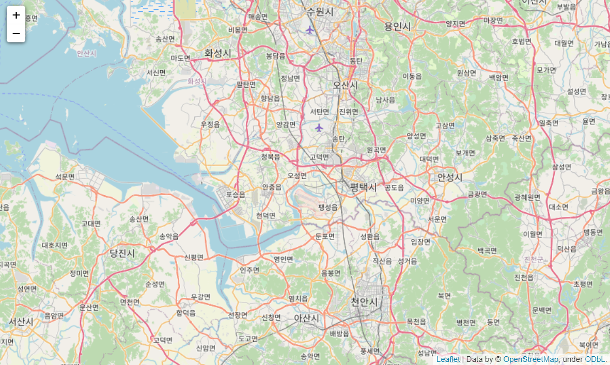
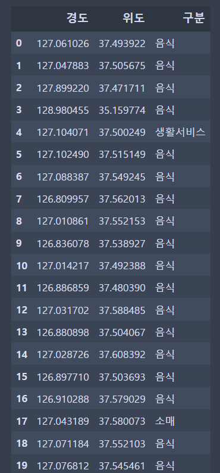
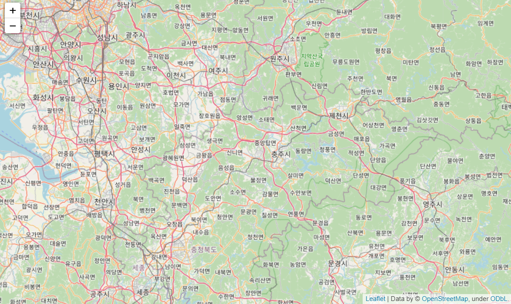
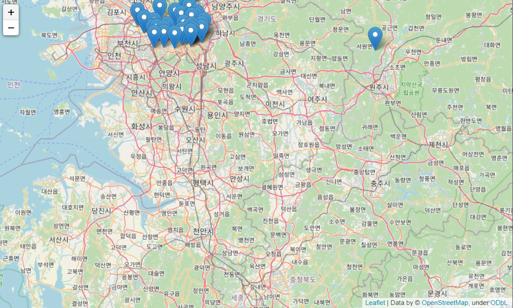
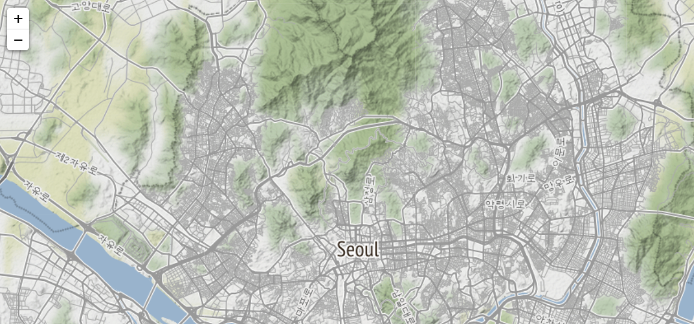
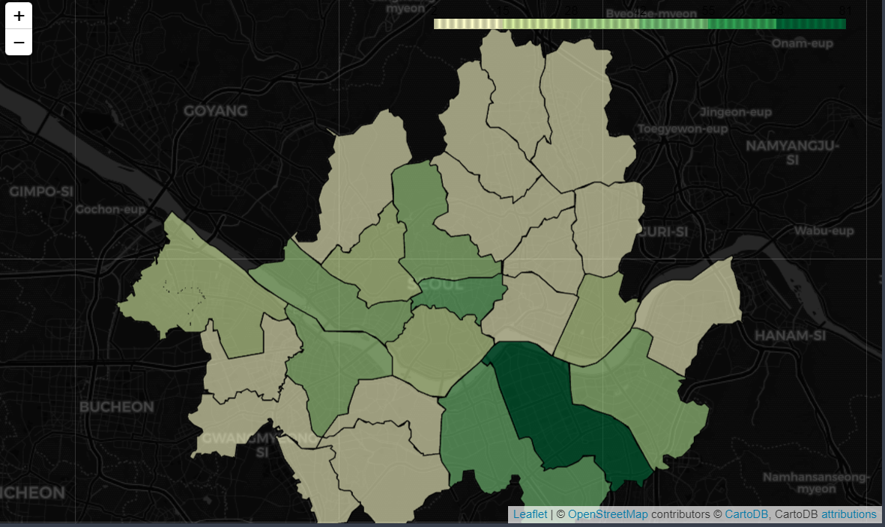

## Ds_Day 1


### datetime 패키지

시간 관련 패키지이다.


### datetime.now()

현재 시간을 마이크로세컨까지 알려준다.

```python
dt.datetime.now()
```

> ```
> datetime.datetime(2021, 9, 21, 2, 34, 3, 408628)
> ```


속성 값으로는 다음을 사용할 수 있다.

```python
#날짜/시간 속성들
a.year
a.month
a.day
a.hour
a.minute
a.second
a.microsecond
```


### weekday

요일을 숫자로 리턴해주는 함수. 월요일:0 ~ 일요일:6 으로 리턴해준다.

```python
a=dt.datetime.now() # 작성당시 요일 :화요일
a.weekday()
```

> 1


### strftime

날짜 형식 변환 함수

```python
a.strftime("%A %d. %B %Y")
```

> ```
> 'Monday 19. July 2021'
> ```


```
 %A : locale 요일
 %B : locale 월
 %d : 0을 채운 10진수 표기로 날짜를 표시
 %Y : 0을 채운 10진수 표기로 4자리 년도
```

대문자는 모두 표기, 소문자는 약식으로 표기한다.

ex) %A: Monday - > %a: Mon


### strptime

문자열로 된 날짜 데이터 -> 날짜 객체

```python
dt.datetime.strptime("2021-07-19 13:50", "%Y-%m-%d %H:%M")
```

> ```
> datetime.datetime(2021, 7, 19, 13, 50)
> ```


### datetime 객체 계산

datetime 객체를 계산하게되면 timedelta객체로 바뀐다.

```python
dt1=dt.datetime(2021,7,19,14)
dt2=dt.datetime(2021,7,22,18)

td=dt2-dt1
print(td)
td
```

> ```
> 3 days, 4:00:00
> ```
>
> ```
> datetime.timedelta(days=3, seconds=14400)
> ```

이렇게 생성된 timedelta객체에서 몇 일, 몇 초, 마이크로초 단위 까지 알 수 있다.

```python
td.days
td.seconds
print(td.total_seconds()) # 총 시간을 초로 환산
```

> ```
> 273600.0
> ```

ex)  지금까지 살아온 시간(초단위) 출력

```python
(dt.datetime.now()-dt.datetime(1994,10,25,4)).total_seconds()
```

> ```
> 849135110.80669
> ```


### 스크래핑과 크롤링

스크래핑(필요시마다 긁어오는 것, 셀레니움), 크롤링(주기적으로 긁어오는 것)


### urllib

url 모듈의 집합으로 웹 사이트 데이터 추출 관련 패키지

urllib.request은 웹에 있는 데이터에 접근하는 모듈


### urlretrieve

url로 표시된 url 주소의 문서를 로컬파일에 저장. 이미지파일같은 것을 저장할 수 있다.

```python
urllib.request.urlretrieve("https://www.allcon.co.kr/img/logo.new.png","test2.jpg")
print("로고 이미지 다운로드 완료")
```

test2.jpg라는 파일이 저장됨을 확인할 수 있음


request 모듈을 이용하여 페이지 내 텍스트를 긁어와보자

```python
import urllib.request 
import urllib.parse as up

url="http://www.kma.go.kr/weather/forecast/mid-term-rss3.jsp"
myarg={"stnId":"184"}

params=up.urlencode(myarg) # 결과-> stnld=184
addr=url+"?"+params # 
addr
```

> ```
> 'http://www.kma.go.kr/weather/forecast/mid-term-rss3.jsp?stnId=184'
> ```

```python
res=urllib.request.urlopen(addr).read() # 서버로 요청해서 html코드 읽어들임

text=res.decode("utf-8")
print(text)
```

> ```
> <?xml version="1.0" encoding="utf-8" ?>
> <rss version="2.0">
> <channel>
> <title>기상청 육상 중기예보</title>
> <link>http://www.kma.go.kr/weather/forecast/mid-term_07.jsp</link>
> <description>기상청 날씨 웹서비스</description>
> <language>ko</language>
> <generator>기상청</generator>
> <pubDate>2021년 07월 19일 (월)요일 06:00</pubDate>
>  <item>
> <author>기상청</author>
> <category>육상중기예보</category>
> <title>제주도 육상 중기예보 - 2021년 07월 19일 (월)요일 06:00 발표</title>
> <link>http://www.kma.go.kr/weather/forecast/mid-term_07.jsp</link>
> <guid>http://www.kma.go.kr/weather/forecast/mid-term_07.jsp</guid>
> <description>
> 	<header>
> 		<title>제주도 육상중기예보</title>
> 		<tm>202107190600</tm>
> 		<wf><![CDATA[○ (하늘상태) 이번 예보기간 동안 구름많거나 흐리겠습니다.<br />○ (기온) 이번 예보기간 동안 기온은 어제(18일, 아침기온 23~24도, 낮 기온 28~31도)보다 높겠습니다.<br />○ (해상) 제주도해상과 남해서부해상은 22일(목)에는 2~5m로 매우 높게 일겠고, 그 밖의 날은 1~3m로 일겠습니다.<br /><br /> * 이번 예보기간 동안 낮최고기온이 33도 이상, 아침최저기온이 25도 이상으로 올라 매우 무덥겠으니, 건강관리에 각별히 유의하기 바랍니다.<br /> * 또한, 북태평양고기압 위치에 따라서 낮최고기온의 변동성이 크겠으니, 앞으로 발표되는 기상정보를 참고하기 바랍니다.]]></wf>
> 	</header>
> 	<body>
> 				
> 
> 		<location wl_ver="3">
> 				<province>제주도</province>
> 				<city>제주</city>
> 				
> 				<data>
> 					<mode>A02</mode>
> 					<tmEf>2021-07-22 00:00</tmEf>
> 					<wf>구름많음</wf>
> 					<tmn>26</tmn>
> 					<tmx>33</tmx>
> 					<reliability></reliability>
> 					<rnSt>30</rnSt>
> 				</data>
> 				
> 				....
> 				etc
> ```


## Ds_Day2


### BeautifulSoup

웹 서버에서 가져온 웹 문서를 우리가 분석할 수 있도록 분석 가능한 형태의 문서 객체로 변환해주는 도구 -> html, xml문서를 추출(분석)하는 도구

```python
import urllib.request as req
from bs4 import BeautifulSoup

url = "http://www.kma.go.kr/weather/forecast/mid-term-rss3.jsp"
# 참조할 페이지의 url주소를 가져와준다.

res=req.urlopen(url)
# request모듈의 urlopen 함수에다가 url주소를 넣어주고

soup=BeautifulSoup(res, 'html.parser')
# beautifulsoup을 이용하여 res(결과)를 html로 읽어들임
# parser: 구문을 해석해주는 번역기라고 생각하면 된다.

soup
```

> ```
> <?xml version="1.0" encoding="utf-8" ?>
> <rss version="2.0">
> <channel>
> <title>기상청 육상 중기예보</title>
> <link/>http://www.kma.go.kr/weather/forecast/mid-term_01.jsp
> <description>기상청 날씨 웹서비스</description>
> <language>ko</language>
> <generator>기상청</generator>
> <pubdate>2021년 09월 22일 (수)요일 18:00</pubdate>
> <item>
> <author>기상청</author>
> <category>육상중기예보</category>
> <title>전국 육상 중기예보 - 2021년 09월 22일 (수)요일 18:00 발표</title>
> <link/>http://www.kma.go.kr/weather/forecast/mid-term_01.jsp
> <guid>http://www.kma.go.kr/weather/forecast/mid-term_01.jsp</guid>
> <description>
> <header>
> <title>전국 육상중기예보</title>
> <tm>202109221800</tm>
> <wf><![CDATA[○ (강수) 29일(수) 오후에는 전국에 비가 오겠습니다.<br />○ (기온) 이번 예보기간 아침 기온은 14~21도, 낮 기온은 23~27도로 오늘(22일, 아침최저기온 17~22도, 낮최고기온 23~30도)보다 조금 낮겠습니다.<br />○ (주말전망) 25일(토)~26일(일)은 구름많겠으나, 강원영동과 경북동해안은 25일(토) 흐리고 오전까지 가끔 비가 오겠습니다. 아침 기온은 14~20도, 낮 기온은 22~27도가 되겠습니다.]]></wf>
> </header>
> <body>
> <location wl_ver="3">
> <province>서울ㆍ인천ㆍ경기도</province>
> <city>서울</city>
> <data>
> 
> ...
> 
> 생략
> ```

```python
print(soup.find("title")) # title 태그를 찾아줌
print(soup.find("title").string) # title 태그에 써있는 문자열을 리턴해줌
```

> ```
> <title>기상청 육상 중기예보</title>
> 기상청 육상 중기예보
> ```


```python
wf=soup.find('wf').string
#여기에다가 정규표현식 작성(한글만..숫자만...)
wf
```

> ```
> '○ (하늘상태) 전국이 가끔 구름많겠습니다.<br />○ (기온) 이번 예보기간 아침 기온은 23~26도, 낮 기온은 30~36도로 어제(19일, 아침최저기온 23~26도, 낮최고기온 30~33도)와 비슷하거나 높겠습니다.<br />○ (주말전망) 24일(토)과 25일(일)은 전국이 가끔 구름많겠습니다. 주말 동안 아침 기온은 23~26도, 낮 기온은 32~36도가 되겠습니다.<br /> * 이번 예보기간 동안 우리나라는 북태평양고기압 영향을 받으면서 전국 대부분 지역에서 낮최고기온이 33도 이상, 아침최저기온이 25도 이상으로 오르겠고,  <br />   특히, 이번 주에는 동풍의 영향을 받는 서쪽 일부 지역에서 낮최고기온이 38도 이상 올라가면서 매우 무덥겠으니 건강관리에 각별히 유의하기 바랍니다. <br /> * 또한, 북태평양고기압 위치에 따라서 낮최고기온의 변동성이 크겠으니, 앞으로 발표되는 기상정보를 참고하기 바랍니다.'
> ```


이런식으로 태그에 해당하는 문자열을 리턴받고 여기서 정규표현식을 사용하여 원하는 결과값을 찾는 방식이다.


간단한 예제로 연습해보자

```python
html="""
<html><body><h1>스크레핑</h1><p>웹 페이지 분석</p><p>원하는 부분 추출</p></body></html>"""

soup=BeautifulSoup(html,'html.parser')

print(soup.find("h1")) # h1 태그 리턴
print(soup.html.body.h1) # h1 태그 리턴 (find 함수 사용 x)
print(soup.html.body.p)
# soup.p
# soup.body.p
print(soup.html.body.p)
```

> ```
> <h1>스크레핑</h1>
> <h1>스크레핑</h1>
> <p>웹 페이지 분석</p>
> <p>웹 페이지 분석</p>
> ```

soup객체에서 원하는 태그를 리턴하고 싶을 때 find함수 안에 태그 명을 입력하여 찾아봐도 되고

.(dot)을 사용하여 참조해도 가능하다.


### next_sibling

다음 태그에 접근이 가능한 함수

```python
sib1=soup.html.body.h1 
print(sib1)
print(sib1.next_sibling)
```

> ```
> <h1>스크레핑</h1>
> <p>웹 페이지 분석</p>
> ```

sib1.next_sibling의 결과값이 다음 태그를 리턴해주는 것을 확인할 수 있다.


한번 더 확인해보자

```python
html="""<html><body><h1>스크레핑</h1><p>웹 페이지 분석</p><p>원하는 부분 추출</p></body></html>"""
soup=BeautifulSoup(html,'html.parser')
print(soup)

#줄 바꿈 문자가 없는 html 문서
print(soup.html.body.p) #<p>웹 페이지 분석</p>
print(soup.html.body.p.next_sibling) #<p>원하는 부분 추출</p>
print(soup.html.body.p.next_sibling.next_sibling) #더 이상 형제가 없음
```

> ```
> <html><body><h1>스크레핑</h1><p>웹 페이지 분석</p><p>원하는 부분 추출</p></body></html>
> <p>웹 페이지 분석</p>
> <p>원하는 부분 추출</p>
> None
> ```


여기서 주의할 점은 next_sibling은 줄바꿈 문자도 리턴해준다는 점이다.

이번 예제에는 줄바꿈 문자를 추가해서 결과를 확인해보자

```python
html="""
<html> \n
<body> \n
    <h1>스크레핑</h1> \n
    <p>웹 페이지 분석</p> \n
    <p>원하는 부분 추출</p> \n
</body>
</html>
"""

soup=BeautifulSoup(html,'html.parser')
print(soup)
```

> ```
> <html>
> <body>
> <h1>스크레핑</h1>
> <p>웹 페이지 분석</p>
> <p>원하는 부분 추출</p>
> </body>
> </html>
> ```

이번에는 soup 출력 시 줄바꿈이 되어 출력되는것을 확인할 수 있다.


```python
print(soup.html.body.h1)
print(soup.html.body.h1.next_sibling)
print(soup.html.body.h1.next_sibling.next_sibling.next_sibling.next_sibling.next_sibling.next_sibling)
```

> ```
> <h1>스크레핑</h1>
> 
> 
> None
> ```

2번째 print문의 결과값이 안 나온것처럼 보이지만 출력된 값이 줄바꿈 문자라서 안보이는 것이다.

이것으로 next_sibling은 \n (줄바꿈문자)도 리턴해준다는것을 알 수 있다.


### find_all

find는 처음 찾은 것만 리턴해주고  find_all은 모든 값을 리스트 형태로 리턴해준다.

```python
print(soup.find("a"))
print(soup.find_all("a"))
```

> ```
> <a href="http://www.naver.com">naver</a>
> [<a href="http://www.naver.com">naver</a>, <a href="http://www.daum.net">daum</a>]
> ```


### attrs

특정 속성명에 해당되는 값을 추출하고자 하는 경우에 사용한다.

```python
links=soup.find_all("a")

for i in links:
    print(i.attrs)
    print("==========================")
    print(i.attrs.values())
    print("==========================")
    print(i.attrs['href'])
    print("==========================")
    print(i.string)
    print("==========================")
```

> ```
> {'href': 'http://www.naver.com'}
> ==========================
> dict_values(['http://www.naver.com'])
> ==========================
> http://www.naver.com
> ==========================
> naver
> ==========================
> {'href': 'http://www.daum.net'}
> ==========================
> dict_values(['http://www.daum.net'])
> ==========================
> http://www.daum.net
> ==========================
> daum
> ==========================
> ```


```python
html4="""
<p><a href="aaa.html" name="kkk">aaa page</a></p>
"""
soup=BeautifulSoup(html4, 'html.parser')
```

여기서 각 속성에 해당하는 값을 출력해보자

```python
# aaa.html 출력
print(soup.a.attrs["href"])

# kkk 출력
print(soup.a.attrs["name"])

# aaa page 출력
print(soup.a.string)
```

> ```
> aaa.html
> kkk
> aaa page
> ```


### select, select_one

find, find_all 함수처럼 찾으려하는 태그를 리턴해주는 함수이다.

**select_one**는 find처럼 가장 먼저 찾는 태그 하나를 리턴

**select**는 find_all처럼 전부 찾아주고 리스트로 리턴해준다.

```python
print(soup.select_one("li"))
print(soup.select("li"))
```

> ```
> <li>python</li>
> [<li>python</li>, <li>java</li>, <li>cpp</li>, <li>python</li>, <li>java</li>, <li>cpp</li>]
> ```


id 이름 혹은 하위태그로 참조하는 방법은 이렇게 된다.

```python
print(soup.select("div#lang"))
print("=======================")
print(soup.select("div#lang > h1")[0].string)
print("=======================")
print(soup.select("div#lang > ul > li"))
```

> ```
> [<div id="lang">
> <h1>programming</h1>
> <ul class="items">
> <li>python</li>
> <li>java</li>
> <li>cpp</li>
> </ul>
> </div>]
> =======================
> programming
> =======================
> [<li>python</li>, <li>java</li>, <li>cpp</li>]
> ```


find_all 함수안에 정규표현식으로 원하는 조건을 넣을 수 있다.

```python
html = """
<ul>
  <li><a href="hoge.html">hoge</li>
  <li><a href="https://example.com/fuga">fuga*</li>
  <li><a href="https://example.com/foo">foo*</li>
  <li><a href="http://example.com/aaa">aaa</li>
</ul>
"""
soup=BeautifulSoup(html, 'html.parser')

soup.find_all(href=re.compile('^https://')) # href 값이 https://로 시작하는 태그 리턴
```

> ```
> [<a href="https://example.com/fuga">fuga*</a>,
>  <a href="https://example.com/foo">foo*</a>]
> ```


## Ds_Day 6


### folium

leaft.js를 기반으로 지도를 그려주는 시각화 패키지.

### Map

위도,경도를 찍어주면 해당위치를 표시해준다.

```python
m = folium.Map(location=[37,127])
m
```

> 


​	m.save("index.html") -> .save 함수를 사용하면 저장도 가능하다.

**zoom_start** 파라미터를 통해 확대정도를 정할 수 있다.


folium은 dataframe과 같이 사용할 수 있다.

```python
test = {'경도' : [127.061026,127.047883,127.899220,128.980455,127.104071,127.102490,127.088387,126.809957,127.010861,126.836078
                ,127.014217,126.886859,127.031702,126.880898,127.028726,126.897710,126.910288,127.043189,127.071184,127.076812
                ,127.045022,126.982419,126.840285,127.115873,126.885320,127.078464,127.057100,127.020945,129.068324,129.059574
                ,126.927655,127.034302,129.106330,126.980242,126.945099,129.034599,127.054649,127.019556,127.053198,127.031005
                ,127.058560,127.078519,127.056141,129.034605,126.888485,129.070117,127.057746,126.929288,127.054163,129.060972],
'위도' : [37.493922,37.505675,37.471711,35.159774,37.500249,37.515149,37.549245,37.562013,37.552153,37.538927,37.492388
              ,37.480390,37.588485,37.504067,37.608392,37.503693,37.579029,37.580073,37.552103,37.545461,37.580196,37.562274
              ,37.535419,37.527477,37.526139,37.648247,37.512939,37.517574,35.202902,35.144776,37.499229,35.150069,35.141176
              ,37.479403,37.512569,35.123196,37.546718,37.553668,37.488742,37.493653,37.498462,37.556602,37.544180,35.111532
              ,37.508058,35.085777,37.546103,37.483899,37.489299,35.143421],  
        '구분' : ['음식','음식','음식','음식','생활서비스','음식','음식','음식','음식','음식','음식','음식','음식','음식','음식'
             ,'음식','음식','소매','음식','음식','음식','음식','소매','음식','소매','음식','음식','음식','음식','음식','음식'
             ,'음식','음식','음식','음식','소매','음식','음식','의료','음식','음식','음식','소매','음식','음식','음식','음식'
             ,'음식','음식','음식']}

df = pd.DataFrame(test)
df
```

> 

```python
latAvg = df["위도"].mean() # 위도에 대한 평균 구하는 함수
longAvg = df["경도"].mean()

m = folium.Map([latAvg,longAvg], zoom_start=9)
m
```

> 


### Marker

해당 위치에 마커를 찍어준다.

```python
for i in df.index: # dataFrame에 자동적으로 저장되는 index를 통해 for문 돌릴때 사용    
    lat = df.loc[i,"위도"] # loc는 참조할때 사용
    lon = df.loc[i,"경도"]
    title = df.loc[i,"구분"]
    folium.Marker([lat,lon],tooltip=title).add_to(m) # 표시하고 싶은 위치
m
```

> 

**tiles** 파라미터는 지도의 스타일을 지정해준다.

옵션참고: https://python-visualization.github.io/folium/quickstart.html#Getting-Started

```python
starbucksMap = folium.Map([37.57, 126.98], zoom_start =12, tiles="Stamen Terrain")
starbucksMap
```

> 


### Choropleth

판다스, 지오메트리와 같이 사용하여 지역 시각화할 때 사용한다.

```python
folium.Choropleth(
    geo_data = seoul_sgg_geo2,
    data = seoul_sgg_stat,
    columns=["시군구명","스타벅스_매장수"],
    fill_color="YlGn",
    key_on = "properties.SIG_KOR_NM"
    
).add_to(starbucksCp)
```

> 


## Ds_Day7


### 넘파이

행렬 혹은 다차원 배열을 쉽게 처리할 수 있도록 지원하는 라이브러리로 수치계산을 효율적으로 한다.


간단한 배열 생성

```python
np.array([1,2,3,4]) # array 함수에 리스트를 넣음, 1차원 배열
```

> ```
> array([1, 2, 3, 4])
> ```


넘파이는 리스트와 다르게 브로드캐스팅 때문에 연산 방식에서 차이가 있다.

```python
# list(1,2,3,4) +1 ->  불가능 
np.array([1,2,3,4])+1 
```

> ```
> array([2, 3, 4, 5])
> ```


당연히 넘파이간 연산도 가능하다

```python
x = np.array([1,2,3])
y = np.array([4,5,6])

print(x * y) # 요소간 곱셈, 요소의 개수가 같아야함
print(2 * x + y)

print(x == y) # 각각의 요소끼리 비교해준다.
print(x > 2) # x내 요소들과 2와의 크기 비교
print((x>2)&(y>4)) # and 연산
```

> ```
> [ 4 10 18]
> [ 6  9 12]
> [False False False]
> [False False  True]
> [False False  True] # 마지막 요소만 만족하기 때문!!
> ```


**넘파이의 1차원 배열은 벡터, 2차원 배열은 행렬이다.**

행렬을 만드는 방법은 2중 리스트로 만들면 된다.

```python
# 2*3 배열
x = np.array([[1,2,3],
              [4,5,6]])

print(len(x)) # 행의 개수
print(len(x[0])) # 열의 개수
```

> ```
> 2
> 3
> ```


3차원 배열은 3중 리스트로 만들면 된다.

```python
x = np.array([[[1,2,3],[1,2,3]],[[1,2,3],[1,2,3]]])# [[리스트,리스트],[리스트,리스트]] 이런 구조로 만든다.
x
```

> ```
> array([[[1, 2, 3],
>         [1, 2, 3]],
> 
>        [[1, 2, 3],
>         [1, 2, 3]]])
> ```


3차원 배열의 행의 개수에서 유의할 점이 **깊이랑 헷갈리면 안된다**. (스터디 질문으로 해보자)

```python
x = np.array([[[1, 2, 3, 4],
               [5, 6, 7, 8],
               [9, 10, 11, 12]],
              [[11, 12, 13, 14],
               [15, 16, 17, 18],
               [19, 20, 21, 22]]])
# x 배열의 깊이 : 2
# x 배열의 행 : 3
# x 배열의 열 : 4
# x 배열의 shape? 2*3*4 배열

print(x)

print(len(x)) # 깊이
print(len(x[0])) # 행
print(len(x[0][0])) # 열
```

> ```
> [[[ 1  2  3  4]
>   [ 5  6  7  8]
>   [ 9 10 11 12]]
> 
>  [[11 12 13 14]
>   [15 16 17 18]
>   [19 20 21 22]]]
> 2
> 3
> 4
> ```


### ndim, shape

**ndim**: 배열의 차원을 알려줌

**shape**: 배열의 크기를 알려줌

```python
print(x.ndim)  # 배열의 차원을 알려줌. n=number, dim = dimenssion
print(x.shape) 
```

> ```
> 3
> (2, 3, 4) # 깊이, 행, 열
> ```


### boolean참조

넘파이도 데이터프레임처럼 불린참조가 가능하다

```python
x = np.array([1,2,3])
b = np.array([True,False,True])

x[b]
```

> ```
> array([1, 3])
> ```

```python
x>1
x[x>1]
```

> ```
> array([2, 3])
> ```


짝수, 홀수 판별도 아주 쉽게 가능

```python
x = np.array([1,2,3])
x[x%2==1]
```

> ```
> array([1, 3])
> ```


### 정수 배열 인덱싱

배열로 다른 배열의 인덱싱도 가능하다

```python
x = np.array([10,20,30,40,50])
y = np.array([0,2,4])

x[y]
```

> ```
> array([10, 30, 50])
> ```


참조배열은 인덱스 번호로 사용하기 때문에 참조하려는 배열의 수보다 인덱싱용 배열의 길이가 길어도 상관없다. (quiz2)

```python
x = np.array([10,20,30,40,50])
y = np.array([0,2,4,0,0,2,1])

x[y] # 인덱스 요소 개수가 더 많아도 가능하다!
```

> ```
> array([10, 30, 50, 10, 10, 30, 20])
> ```


### dtype

넘파이 요소의 데이터타입을 바꿔주는 파라미터이다.

```python
np.array([1,2], dtype = "f") # 데이터 타입을 float으로 변형
```

> ```
> array([1., 2.], dtype=float32)
> ```


### zeros, ones

**zeros**: 배열의 모든 요소를 0으로 채워줌

**ones**: 배열의 모든 요소를 1로 채워줌

```python
print(np.zeros(3))
print("===============")
print(np.zeros((3,2,4)))
```

> ```
> [0. 0. 0.]
> ===============
> [[[0. 0. 0. 0.]
>   [0. 0. 0. 0.]]
> 
>  [[0. 0. 0. 0.]
>   [0. 0. 0. 0.]]
> 
>  [[0. 0. 0. 0.]
>   [0. 0. 0. 0.]]]
> ```

```python
np.ones((2,3,4))
```

> ```
> array([[[1., 1., 1., 1.],
>         [1., 1., 1., 1.],
>         [1., 1., 1., 1.]],
> 
>        [[1., 1., 1., 1.],
>         [1., 1., 1., 1.],
>         [1., 1., 1., 1.]]])
> ```


### zeros_like, ones_like

배열의 크기와 동일한 배열을 생성하는데 요소값들을 zeros는 0, ones는 1로 채워준다

```python
x = np.ones((2,3,4))

y = np.zeros_like(x, dtype = "i")
y
```

> ```
> array([[[0, 0, 0, 0],
>         [0, 0, 0, 0],
>         [0, 0, 0, 0]],
> 
>        [[0, 0, 0, 0],
>         [0, 0, 0, 0],
>         [0, 0, 0, 0]]], dtype=int32)
> ```


그런데 위의 함수는 1,0 으로 초기화하는 과정이 오래걸린다.

그래서 empty라는 함수를 사용한다. empty함수는 뼈대만 만들어준다고 생각하면 된다.

```python
np.empty((3,2))
# 정확하게는 안에는 0이 아니지만 기존에 메모리에 남아있는 쓰레기값으로 초기화 해줌
# 뼈대만 만들어준다고 생각하자(안에 데이터는 의미없는 값으로 채워주는 것)!
```

> ```
> array([[0., 0.],
>        [0., 0.],
>        [0., 0.]])
> ```


### reshape

배열의 차원을 다시 만들어주는 함수

```python
print(np.array(list(range(8))))
print("========================")
print(np.array(list(range(8))).reshape(2,2,2))
```

> ```
> [0 1 2 3 4 5 6 7]
> ========================
> [[[0 1]
>   [2 3]]
> 
>  [[4 5]
>   [6 7]]]
> ```


위에서 list와 range함수를 사용하여 연속된 숫자의 배열을 만들었는데 이걸 쉽게해주는 함수가있다.

### arange

배열에서 연속된 숫자를 만들어주는 함수이다.

```python
print(np.arange(8)) # == np.array(list(range(8)))
np.arange(8).reshape(2,4)
```

> ```
> [0 1 2 3 4 5 6 7]
> ```
>
> ```
> array([[0, 1, 2, 3],
>        [4, 5, 6, 7]])
> ```


### linspace

구간과 개수를 지정하면 동일한 길이로 잘라주는 함수이다. pd.cut 함수와 대신 사용해도 괜찮을듯하다. 구간을 나눠줄때도!

```python
np.linspace(0, 100, 10) # 선형 구간, 시작, 끝, 개수
```

> ```
> array([  0.        ,  11.11111111,  22.22222222,  33.33333333,
>         44.44444444,  55.55555556,  66.66666667,  77.77777778,
>         88.88888889, 100.        ])
> ```


### 전치행렬

행열의 행과 열을 바꿔놓은 행렬이다. 간단하게 배열뒤에.T를 붙이면 된다.

```python
X = np.arange(1,7).reshape(2,3)
print(X)
print("\n")
print(X.T)
```

> ```
> [[1 2 3]
>  [4 5 6]]
> 
> 
> [[1 4]
>  [2 5]
>  [3 6]]
> ```


### flatten, ravel

다차원 배열을 1차원으로 만들어주는 함수이다.

```python
x = x.reshape(2,3,-1)

print(x)
print("\n")
print(x.flatten())
print(x.ravel())
```

> ```
> [[[ 0  1  2  3]
>   [ 4  5  6  7]
>   [ 8  9 10 11]]
> 
>  [[12 13 14 15]
>   [16 17 18 19]
>   [20 21 22 23]]]
> 
> 
> [ 0  1  2  3  4  5  6  7  8  9 10 11 12 13 14 15 16 17 18 19 20 21 22 23]
> [ 0  1  2  3  4  5  6  7  8  9 10 11 12 13 14 15 16 17 18 19 20 21 22 23]
> ```


## Ds_Day 11

### counter

( ) 안에 있는 요소들의 개수를 카운터 객체로 리턴해줌

```python
Counter("hello")
```

> ```
> Counter({'h': 1, 'e': 1, 'l': 2, 'o': 1})
> ```


.most_common() 속성은 ()안에 숫자를 입력하여 가장 많이 나온 단어(문자)를 리턴해 줌

```python
print(Counter("hello").most_common(1))
print(Counter("hello").most_common(3))
```

> ```
> [('l', 2)]
> [('l', 2), ('h', 1), ('e', 1)]
> ```


### Series 클래스

판다스에서는 시리즈(시간계열) 클래스, 데이터프레임 클래스로 나뉘어 짐

시리즈 = 인덱스(데이터의 의미표시)  + 값(데이터)

ex)

인덱스		값

20210804 100
20210805 200
202010806 500


리스트, 1차원 배열로 시리즈를 생성해줄 수 있음

```python
pd.Series([1000,300,200]) # 데이터만 기술, 인덱스 미입력시 인덱스는 0번 부터 자동 부여됨
pd.Series([1000,300,200], index = ["서울인구", "부산인구", "대구인구"])
pd.Series([1000,300,200], index = [10, 20, 30])
x = pd.Series([1000,300,200], index = ["20210804", "20210805", "20210806"])

# 20210804    1000 # 왼쪽에 20210804는 "인덱스 라벨"이라고 부름
# 20210805     300
# 20210806     200
# dtype: int64
```


range 객체로도 시리즈 생성가능

```python
x = pd.Series(range(100,105))
x
```

> ```
> 0    100
> 1    101
> 2    102
> 3    103
> 4    104
> dtype: int64
> ```


`index` `values` 를 통해 값을 확인할 수 있다.

```python
print(x.index) # 인덱스를 보여줌
print(x.values) # 시리즈의 값(데이터)를 보여줌
```

> ```
> Index(['20210804', '20210805', '20210806'], dtype='object')
> [1000  300  200]
> ```


.name 으로 시리즈나 데이터프레임의 이름을 지정해 줄 수 있다.

```python
x.name="데이터 이름"
x
```

> ```
> 20210804    1000
> 20210805     300
> 20210806     200
> Name: 데이터 이름, dtype: int64
> ```


넘파이의 배열처럼 시리즈도 벡터화 연산 수행을 한다.

```python
x = pd.Series([1000,300,200], index = [10,11,12])
x/100 # 각각의 값을 100으로 나눠줄 수 있음
```

> ```
> 10    10.0
> 11     3.0
> 12     2.0
> dtype: float64
> ```


### Label

라벨 혹은 레이블이라고 부름. 시리즈에서 인덱스를 나타내주는 역활

- loc 속성 : Label을 지정하여 데이터를 검색
- iloc 속성 : index를 통해서 데이터를 검색

```python
print(x.loc["20210804"]) # label
print(x.iloc[0]) # index
```

> ```
> 1000
> 1000
> ```


시리즈 인덱스는 고유의 인덱스(0번 부터 시작) 와 라벨로 표현된다.

그래서 평소에 슬라이싱할때 [-1]은 마지막 인덱스를 호출하지만 loc[-1]은 error 가 발생한다.

why? 시리즈의 인덱스는 0번 부터 마지막 번호만 사용하기 때문!

그런데 iloc 속성은 우리가 평소 사용하던 인덱스를 그대로 사용하기 때문에 [-1] 사용 가능

```python
print(x.iloc[-2])
```

> 300


시리즈의 인덱스 활