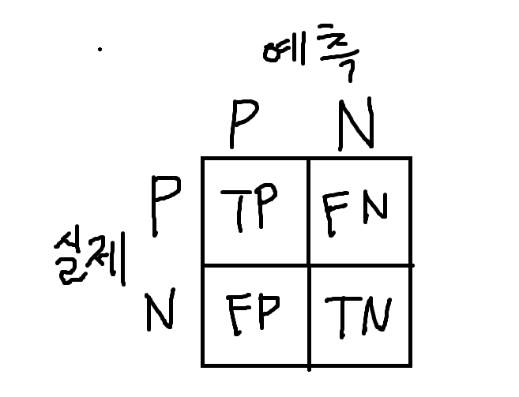
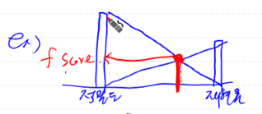
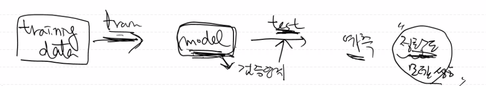
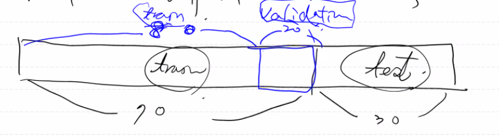
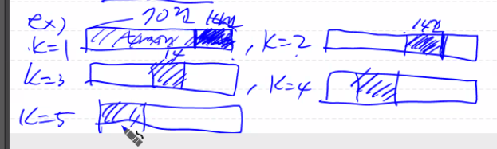

# 2021.09.27

### 과대적합 피하는 방법

- 충분히 많은 data 확보
- 데이터가 부족한 상황, 학습시 사용되는 특징은 많은 경우에 과대적합이 자주 발생 -> 특징을 줄임
- 특징들의 수치값을 정규화 => 편향성을 감소
- 딥러닝에서는 조기종료(early stopping), 드롭아웃(drop out) - 일부를 제거하는 방법

### 혼동 행렬(confusion matrix)

- 모델 성능 평가에 사용하는 행렬
- 

​																	대각선 값이 잘 예측된 값

- 1. TP(True Positive): 맞는 것을 올바르게 예측한 것(ex. 대각선 값들)

     

  2. TN(True Negative): 틀린것을 올바르게 예측(ex. 1 사진에서 아니오, 아니오인 값 -> 아닌값을 아니라고 예측)

     (2 사진에서는 A가 아닌 클래스들을 A가 아니라고 예측한 모든값이면 TN임으로 파란색 박스부분)

  

  3. FP(False Positive): 틀린것을 맞다고 잘 못 예측한 것(ex. A가 아닌 B,C,D,F가 실제값인 데이터들을 입력했을 때 A라고 잘못

     예측한 값들이 A클래스의 FP이다. -> 노란색 박스부분이 A클래스의 FP)

     

  4. FN(False Negative): 맞는 것을 틀렸다고 잘못 예측한 것(ex. A라는 실제 값인 데이터를 입력했을 때, A가 아니라고 예측한 모든 값들이 A클래스의 FN이다 -> 보라색 박스부분이 A클래스의 FN)

     

  5.  ex. 암 분류기 - [ 암 분류: P, 암 아닌 분류: N ] 

     T(맞음)P(예측) -> 암이라고 예측했고, 실제로도 암 / TN -> 암이 아니라고 예측했고, 실제로도 암이 아님

     FP -> 암이 맞다고 예측했는데, 실제로는 암이 아님, FN -> 암이 아니라고 예측했는데 실제로는 암

### 정밀도, 재현율, F1 Score, 정확도

모델을 평가하는 지표

- 정확도(accuracy): 정확히 예측한 데이터의 개수 / 전체 test data 개수

  -> TP+TN / TP+TN+FP+FN

  ​	(예측 암,실제 암) / (예측 암, 실제 암) + (예측 암, 실제 not 암)

- 정밀도(precision): 모델의 예측값이 얼마나 정확하게 예측됐는가

  (양성 클래스[positive]에 속한다고 예측한 결과중에서, 실제로도 양성 클래스에 속하는 비율)

  -> TP / TP+FP ( 높을수록 좋음 )

  

  

- 재현율(recall):  실제 positive(양성)에 속한 데이터에 대해, 예측이 양성이라고 예측한 비율

  -> TP / TP + FN ( 높을수록 좋음 )

- F1 Score(measure): 정밀도와 재현율의 조화평균(정밀도와 재현율 둘 중 누가 더 좋냐고하기 힘들기 때문에 나온 값)

  2x재현율x정밀도 / 재현율 + 정밀도

   

- 위양성율(fallout, FPR[False Positive Rate]): 실제 양성에 속하지 않는 data에 대해 양성이라고 예측한 비율

  -> FP / FP + TN ( 낮을수록 좋음 ) 

  ​	FDS(사기거래 발견 시스템) 측면에서 위양성율은 **실제로는 정상거래인데 사기라고 예측한 거래의 비율**

  ​	특이도: 1 - 위양성율

### K-fold Validation(K-겹 교차검증)

검증단계에서 사용하는 방법

모델의 검증단계에서 모델의 성능을 짐작

검증은 70%를 train데이터, 30%를 test데이터로 나눴을 때 train데이터를 한번 더 나눠서 검증을 하는 것.

ex) 전체 100건이면 train 70건, test 30건으로 나누고 여기서 train 70건을 다시 model용 56건, 검증용 14건으로 나눠서 model을 검증함(검증 후 모델을 개선함)

**k-fold** -> 검증용 데이터 14개를 k번만큼 검증하는것 (검증용데이터의 순서를 바꿔가면서)

​				fold는 구간으로 보면 됨 k=10이면 train 데이터를 10구간으로 나눠줌 -> 검증용 데이터는 7개

​				k=1의 정확도 + k=2의 정확도 + ... + k=5의 정확도 / 5  - >평균 검증 정확도

