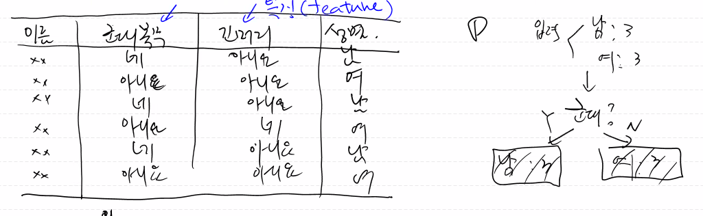
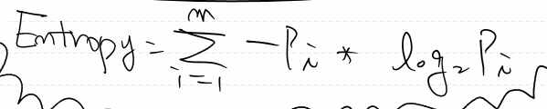
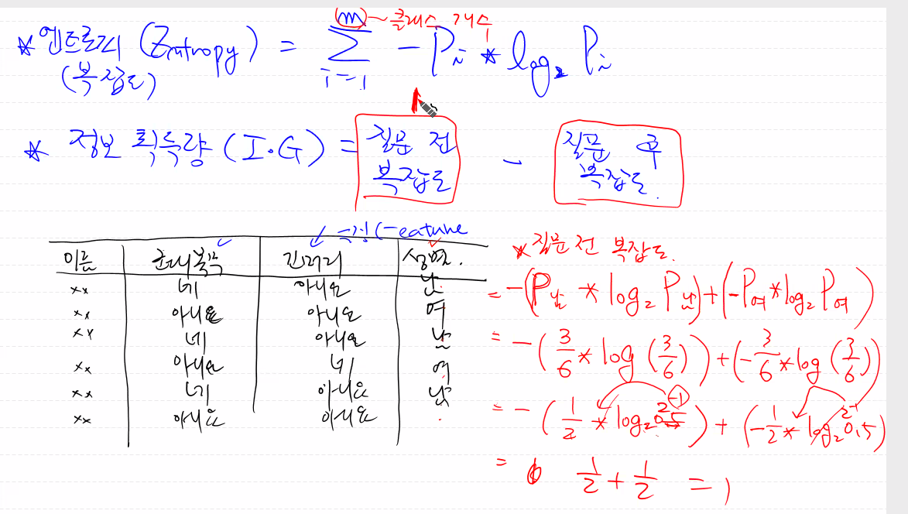

## Decision Tree(의사결정 트리)

회귀, 분류 사용가능한 지도학습 알고리즘 (label- 정답이 존재)

데이터 패턴을 찾아낸 다음 트리기반의 규칙으로 생성(가지치기-pruning). 직관적인 알고리즘

과대적합을 주의해야한다(ex. 트레이닝 데이터의 모든 특징을 if문으로 표현하므로 오버피팅이 발생

-> 트레이닝 데이터의 정확도는 매우 높음. but 테스트 데이터의 정확도는 낮게 나옴)

ex) 스무고개

첫 번째 질문이 가장 중요하다. 잎(leaf)노드가 나올때까지 진행하고 결과로 나온 예 a개, 아니오 b개를 통해 답을 정한다.

좋은 의사결정트리? 

-> 질문의 깊이가 얕으면서도 원하는 답을 내릴 수 있으면 좋은 의사결정트리이다. 트리를 나누는 기준이 중요!

​	ex) 성별을 나누는 의사결정트리 -> 주민등록번호 뒷자리가 몇 번으로 시작하는지?: good질문, 머리가 긴지?: bad질문

​	-> ID3 알고리즘 ( 좋은 질문을 찾아주는 알고리즘)

질문? 데이터의 특징(군대복무, 긴머리)에서 영향력이 큰(잘 분류되는) 특징을 찾아서 상위 노드, 작은 특징은 하위 노드로 트리 구성

ID3 알고리즘 : 영향력이 큰 feature를 찾아내주는 알고리즘

- 엔트로피(Entropy): 복잡도 (ex 데이터가 얼마나 섞여있는지를 뜻함, 남3여3이 복잡도가 제일 큼, 여1이 복잡도 제일 낮음)

  **Information Gain(IG)** = 질문 전의 복잡도(남:3, 여3)  - 질문 후의 복잡도(여1, 남3여2)

  

  IG가 크다? 많이 덜 복잡해졌다.(순도)

  ex) 방이 지저분한데 친구가 온다한다. 이때 급하게 방을 치우는데 하나만 딱 치울 수 있다면 제일 큰것을 치우는게(이불) 효과가 좋을 것이고 볼펜처럼 제일 작은것이 효과가 제일 적을것이다. 이런게 IG이다.

​		엔트로피 구하는 공식(몰라도 됨)

질문 전 복잡도

